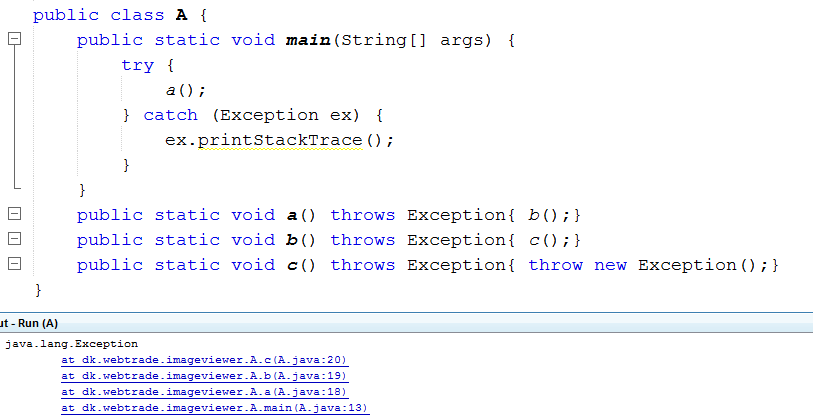
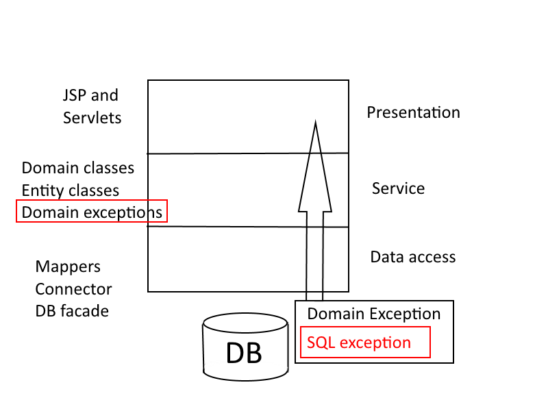

# Error handling
- What are errors in our code
- Why do they happen and
- What should we do about it

READ [This turial here](https://www.tutorialspoint.com/java/java_exceptions.htm)

## What are errors in our java code?
Errors in code i when the code produces erroneous results.  
- 2 + 2 = 5  
- 404 not found  

## Why do the errors happen
When our code create errors it can happen for 3 reasons  
1. The programmer made a mistake  
2. The environment changed unexpectedly  
3. The program user has made a mistake  


### Bad coding
In the first case the programmer has made a mistake e.g:   
- divide by zero  
- index out of bound  
- etc..  


### Problems with the environment
In the second case some physical ressource has failed in some way.  
- internet connection was lost  
- disk error  
- etc..  


### User error
In the third case the user has made an error  
- 403 forbidden when trying to access a protected ressource  
- Not a number when putting letters in a number field in a form  
- etc..  


## How to handle errors
**In java we have Exceptions:**   
When an Exception occurs the normal flow of the program is disrupted and the program/Application terminates abnormally, which is not recommended, therefore, these exceptions are to be handled.   

  


### Checked exceptions
- A checked exception is an exception that occurs at the compile time  
- These are also called 'compile time exceptions'.   
- These exceptions cannot be ignored at the time of compilation  
- The programmer should take care of (handle) these exceptions.  

**Netbeans message: Exception must be caught or declared to be thrown** 
Examples:   
- FileNotFoundException   
- IOException  
- SQLException  
- etc..  

### Unchecked exceptions
- Unchecked exceptions are not checked at compile time. 
- The code will compile even though it throws an exception
- These exceptions mostly comes from bad data (from the user)
- These exceptions are direct sub classes of RuntimeException class
```
int result = 2/0; //this will throw an arithmeticException - but it will compile
```


## Handle exceptions
-Try-cath or   
-Throws

### Try-catch
```   
	
    import java.io.*;
	
	public class ExcepTest {
	
	   public static void main(String args[]) {
	      try {
	         int a[] = new int[2];
	         System.out.println("Access element three :" + a[3]);
	      }catch(ArrayIndexOutOfBoundsException e) {
	         System.out.println("Exception thrown  :" + e);
	      }
	      System.out.println("Out of the block");
	   }
    } 
```    

- Use the exception methods like   
  - e.printStackTrace()
  - e.getMessage()

### Throws - when the exception is thrown down through the stacktrace
```
  public Person getPersons() throws MyException {....}
```



### DON´T
1. catch an exception and do nothing
2. catch an exception and do
	'`Logger.getLogger(A.class.getName()).log(Level.SEVERE, null, ex);`' if Logger is not configured
3. throw architectural layer specific exceptions into layers where they do not belong
	1. eg. SQL exceptions up through the layers to a Servlet (presentation layer)
	2. Instead wrap and modify the exception as a domain layer specific exception -> and push to 
		1. the user or  
		2. a logfile - (depending on the exception.)

### Lets demo
   
**Make example on how to catch sql exception and throw own exception up through the architectural layers and show it to the user**  


